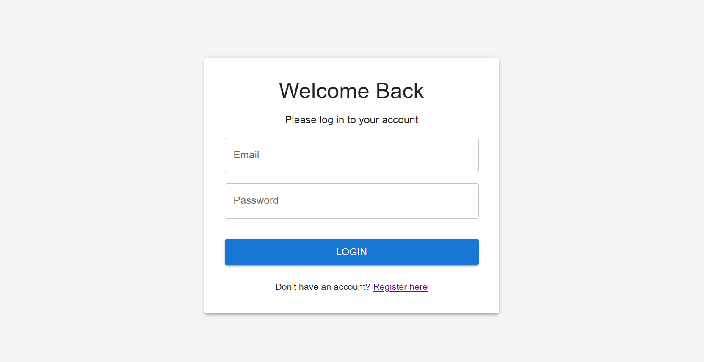

# Mentory Developer Assignment

## Overview
This project is a full-stack web application that allows users to create, manage, and share task lists. It utilizes the following technologies:

- **Frontend**: React with TypeScript
- **Backend**: Laravel
- **Database**: PostgreSQL
- **Containerization**: Docker and Docker Compose

### Core Features
- **User Management**
  - User registration and authentication.
  - User profile with basic information: Name, Email, Username.
  
- **Task Management**
  - Create, read, update, and delete task lists.
  - Add, edit, and remove individual tasks within task lists.
  - Mark tasks as complete/incomplete.

- **Sharing Functionality**
  - Share task lists with other registered users using their username.
  - Set permissions for shared task lists: View or Edit.
  - View task lists that are shared with you.

## Tech Stack
- **Frontend**: React, TypeScript, Vite
- **Backend**: Laravel, PostgreSQL
- **Containerization**: Docker, Docker Compose

## Prerequisites
Before you begin, ensure you have the following installed on your machine:

- **Docker**: Install Docker from [docker.com](https://www.docker.com/).
- **Docker Compose**: Install Docker Compose from [docker.com](https://docs.docker.com/compose/).

## Setup Instructions

### 1. Clone the Repository
Clone this repository to your local machine using:

```bash
git clone https://github.com/yourusername/mentory-developer-assignment.git
cd mentory-developer-assignment
```

### 2. Create a .env File

```bash
APP_NAME=TaskManager
APP_ENV=local
APP_KEY=base64:somekeyhere
APP_DEBUG=true
APP_URL=http://localhost

DB_CONNECTION=pgsql
DB_HOST=db
DB_PORT=5432
DB_DATABASE=task_manager
DB_USERNAME=postgres
DB_PASSWORD=1nl

VITE_API_URL=http://localhost:8000/api


```
### 3. Build and Start the Application
Run the following commands to build and start the Docker containers:

```bash

docker-compose build
docker-compose build      
docker-compose up


This will start both the frontend and backend services. The backend API will be available on http://localhost:8000, and the frontend application will be available on http://localhost:5173.


```

### 4. Access the Application

- **Frontend (React + TypeScript)**: Open your browser and navigate to 
http:/ localhost:5173/. The frontend will communicate with the Laravel backend API.
- **Backend (Laravel)**: The API will be accessible at http://localhost:8000/api/.


### 5. Directory Structure


```bash
.
├── backend/               # Backend Laravel API
│   ├── app/                # Laravel application files
│   ├── config/             # Laravel config files
│   ├── database/           # Database migrations and seeds
│   ├── public/             # Public files, including index.php
│   ├── resources/          # Views and assets for Laravel
│   ├── routes/             # API routes
│   ├── .env                # Laravel environment settings
│   └── Dockerfile          # Dockerfile for backend service
├── frontend/              # Frontend React app
│   ├── src/                # React components and pages
│   ├── public/             # Static assets for the frontend
│   ├── package.json        # Frontend dependencies and scripts
│   ├── vite.config.ts      # Vite configuration for React + TypeScript
│   ├── .env                # Environment settings for the frontend
│   └── Dockerfile          # Dockerfile for frontend service
├── .env.example            # Example environment settings
├── docker-compose.yml      # Docker Compose configuration file
└── README.md               # This README file


```


### 6. API Endpoints

Here is a list of some key API endpoints available in the backend:

#### Authentication Routes
- **POST** `/api/register`  
  Register a new user.

- **POST** `/api/login`  
  Login a user and receive a JWT token for authentication.

#### Task Lists Routes
- **GET** `/api/task-lists`  
  Fetch all task lists for the authenticated user.

- **POST** `/api/task-lists`  
  Create a new task list.

- **GET** `/api/task-lists/{taskListId}/tasks`  
  Fetch all tasks in a specific task list.

- **POST** `/api/task-lists/{taskListId}/tasks`  
  Create a new task in a task list.

- **PUT** `/api/task-lists/{taskListId}/tasks/{taskId}`  
  Update a task's details.

- **DELETE** `/api/task-lists/{taskListId}/tasks/{taskId}`  
  Delete a task.

#### Sharing Task Lists
- **POST** `/api/task-lists/{taskListId}/share`  
  Share a task list with other users.

- **GET** `/api/task-lists/{taskListId}/shared`  
  List all users who have access to a specific task list.

- **PUT** `/api/task-lists/{taskListId}/shared/{userId}`  
  Update permission for a shared task list.

- **DELETE** `/api/task-lists/{taskListId}/shared/{userId}`  
  Revoke access for a shared task list.

#### Other Routes
- **GET** `/api/task-lists/shared-with-me`  
  Fetch all task lists that have been shared with the authenticated user.

- **GET** `/api/user`  
  Get the authenticated user's profile information.


## Project Screenshot

This is the project screenshot showing the task lists.




You can interact with the task lists, create tasks, and manage them via the UI.
